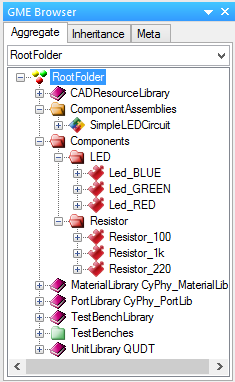

.. _led_building_model:

Building a Basic LED Circuit Model
----------------------------------

In this first section, we'll build a
simple LED circuit. Engineers often use multiple types of analysis
software to test their designs. This practice takes time; you need to
learn each piece of software and compose a model for each one that will
test for a parameter. However, the OpenMETA tools allow you to run
multiple types of analyses by composing just one model.

Creating a New Component Assembly
~~~~~~~~~~~~~~~~~~~~~~~~~~~~~~~~~

In the OpenMETA tools, we build a design by instantiating
components and joining their interfaces, yielding a *Component
Assembly*. We call this process *composition*. From this composed
design, we can generate new models and run analyses.

We begin by connecting our components in a single component assembly.
Let's set up our **Component Assembly** by making a new folder and
model.

In the **GME Browser** window:

1. Right-click on the **RootFolder**, and choose **Insert Folder -->
   Component Assemblies**.
2. Right-click on **ComponentAssemblies**, and choose
   **Insert Model --> Component Assembly**.
3. Rename this new component assembly **SimpleLEDCircuit**.

Browsing the Component Library
~~~~~~~~~~~~~~~~~~~~~~~~~~~~~~

In the **GME Browser** window:

1. Expand the **RootFolder** to see the folders in your project.
2. Expand the **Components** folder, as well as its subfolders (LED
   and Resistor), to see the available components.

We have included six components into your project file: three resistors
and three LEDs.

.. _populate_the_component_assembly:

Populate the Component Assembly
~~~~~~~~~~~~~~~~~~~~~~~~~~~~~~~

Double-clicking on **SimpleLEDCircuit** will open a white canvas.

To populate a component assembly, the components need to be copied and
pasted into the canvas as *references*. There are two ways to do this.
We will show you the two different methods as we instantiate the LED and
Resistor components.

Instantiate an LED using Method 1:
^^^^^^^^^^^^^^^^^^^^^^^^^^^^^^^^^^

1. In your **GME Browser**, locate **Led_GREEN** in the
   **Components** folder.
2. Right-click on it and choose **Copy**.
3. Right-click on your white canvas, and choose **Paste Special --> As
   Reference**.

Instantiate a resistor using Method 2:
^^^^^^^^^^^^^^^^^^^^^^^^^^^^^^^^^^^^^^

1. In your **GME Browser**, locate **Resistor_1k**.
2. **Drag and drop** the resistor onto your white canvas with a
   **right-click**.
3. Select **Create Reference**.

.. warning:: Do not drag with left-click as this will remove the component from
   its containing folder and void any references that point to this component.
   Undo this with :kbd:`(Control-z)` or by selecting ":menuselection:`Edit -->
   Undo`" from the menu.

In the future, you can use whichever method you prefer, since they
produce the same result.

.. _joining_the_component_interfaces:

Joining the Component Interfaces
~~~~~~~~~~~~~~~~~~~~~~~~~~~~~~~~

The flow of current in this simple design will be as follows:
:menuselection:`Voltage Source --> 1k Resistor --> LED --> Ground`. Since we
don't have a power source or ground connection yet, we'll start by joining the
:menuselection:`1k Resistor --> LED`.

1. Change your cursor to **Connect Mode** by pressing :kbd:`(Control-2)` or
   clicking the **Connect Mode** button |CONNECTMODE| in the toolbar.
2. Click the icon next to **P2** of the Resistor.
3. Click the icon next to **Anode** of the LED.

If something goes wrong, you can backtrack with "undo" :kbd:`(Control-Z)` or
:menuselection:`Edit --> Undo`. If you need to remove connections use
**Disconnect Mode**: :kbd:`(Control-3)` or
|DISCONNECTMODE|.

When you are done, return to **Edit Mode**: :kbd:`(Control-3)` or
|EDITMODE|.

.. |CONNECTMODE| image:: images/connectmode2.png
      :alt: Connect Mode icon
      :width: 18px

.. |DISCONNECTMODE| image:: images/disconnectmode2.png
      :alt: Connect Mode icon
      :width: 18px

Creating External Interfaces
~~~~~~~~~~~~~~~~~~~~~~~~~~~~

Our circuit is still missing a power source and sink. We must create two
external connectors into our circuit: power supply and electrical
ground.

Create new external connectors for your component assembly
^^^^^^^^^^^^^^^^^^^^^^^^^^^^^^^^^^^^^^^^^^^^^^^^^^^^^^^^^^

1. In the **Part Browser** window on the left side, locate the **Pin**
   (see the figure below).
2. Drag and Drop two **Pins** into your component assembly with
   **left-click**.
3. Rename the pins to **VCC** and **GND**.

.. image:: images/03-02-pin.png
   :alt: pin part in part browser

Connect external connectors to components
^^^^^^^^^^^^^^^^^^^^^^^^^^^^^^^^^^^^^^^^^

Recall the circuit architecture that we have planned: :menuselection:`Voltage Source
--> 1k Resistor --> LED --> Ground`. We'll use the same method as
connecting the ports of two components.

1. Return your cursor to **Connect Mode** (see `above`__).
2. Create a connection from **VCC** to **P1** of the Resistor.
3. Create a connection from **GND** to **Cath** of the LED.

__ joining_the_component_interfaces_

Although we're counting on the power and electrical ground to be
provided externally, we've implemented the architecture we proposed at
the beginning of the section: :menuselection:`Voltage Source --> LED --> 1k
Resistor --> Ground`. Your component assembly should look like the figure below.

.. figure:: images/03-02-completed-assembly.png

   *Completed LED and Resistor Assembly*
