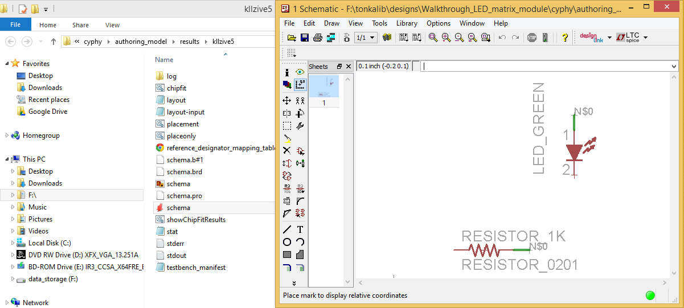

.. _led_generating_the_schematic:

Generating a Schematic
----------------------

The OpenMETA tools support the generation of schematics and layouts for **EAGLE**.
For this type of analysis we will use the **PlaceAndRoute_1x2** test bench,
which generates manufacture-ready files of our component assembly for a
20mm x 40mm printed circuit board.

.. _configuring_a_test_bench:

Configuring a Test Bench
~~~~~~~~~~~~~~~~~~~~~~~~

1. In your **GME Browser**, expand the :menuselection:`TestBenches --> ARA
   TestBenches` folders.
2. Locate the **PlaceAndRoute_1x2** test bench.
3. Double-click it to open it.
4. Create a reference of **SimpleLEDCircuit** in the **Test Bench** by
   copying and pasting as a *reference* using the same method
   introduced in the :ref:`populate_the_component_assembly` section.
5. Select the Reference role type: *TopLevelSystemUnderTest*.

.. note:: The procedure described in steps 4 and 5 is the same for referencing
   a design within any OpenMETA Test Bench.

Running a Test Bench
~~~~~~~~~~~~~~~~~~~~

A test bench is executed by running the **Master Interpreter**. You can find
its icon on the **GME Toolbar**:

.. image:: images/03-02-master-interpreter-on-toolbar.png
   :alt: Master Interpreter on toolbar

1. Click the **Master Interpreter** icon.
2. Make sure **Post to META Job Manager** is checked.
3. Click **OK**.
4. Once your job successfully completes and turns green in the **Active Jobs**
   tab of the :ref:`results_browser`, right-click it and select Show in explorer.

In the folder, you will find a number of different files. One of them is
the generated Eagle schematic: **schema.sch**. Double-click it and open
it with **Eagle**.

.. note:: If this is your first time using Eagle, a dialogue box might ask
   how you want to run Eagle without a license. Click run as Freeware.

You'll see the green LED and 1k resistor that we selected. You may also
notice that the two parts are not connected with lines, but instead with
*nets*. Generated schematics will not include lines, but will instead
use nets like this that identify any number of pins that are connected
together.

If your job does not execute properly, send us a note at
**beta@metamorphsoftware.com**.
