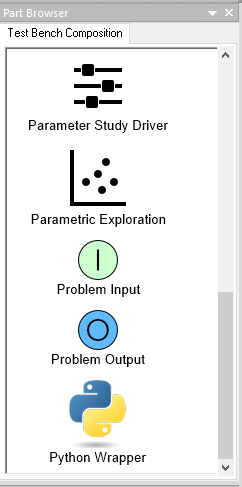
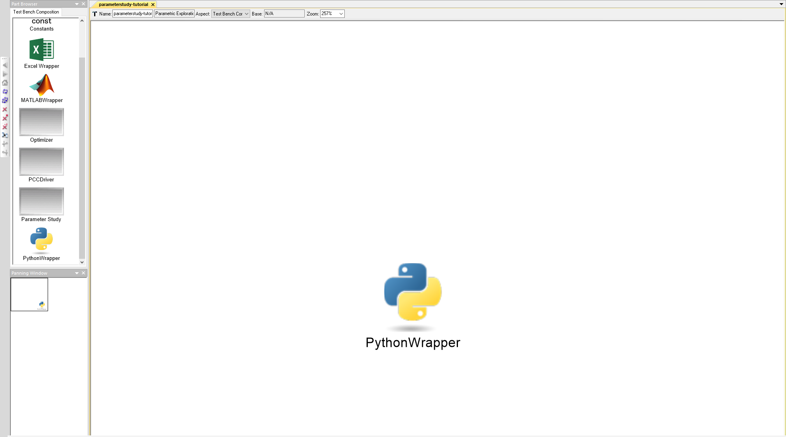
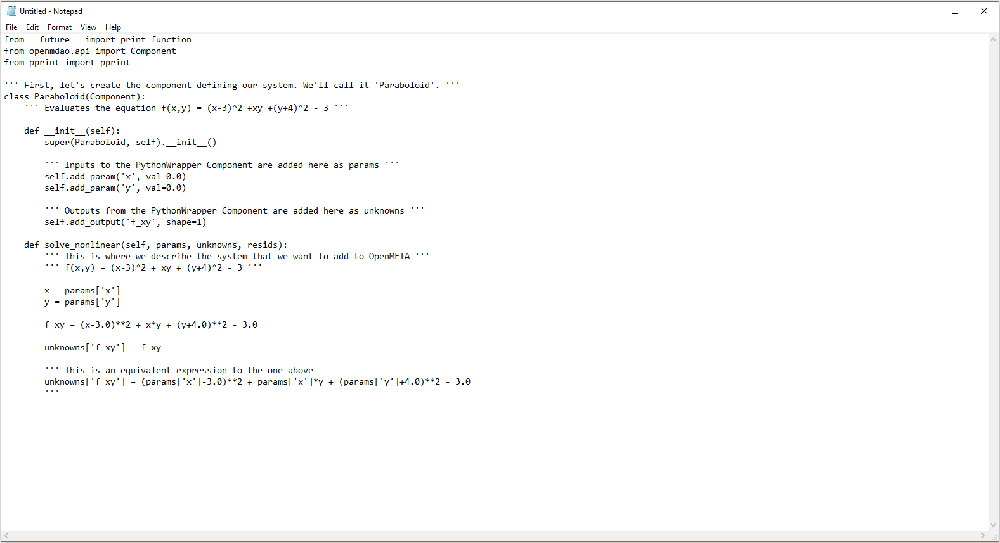
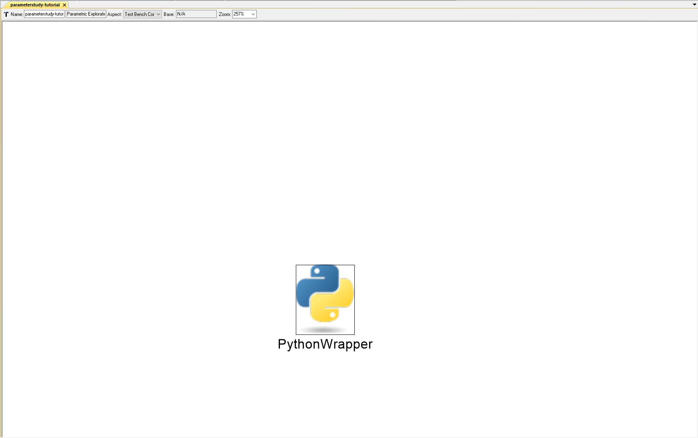
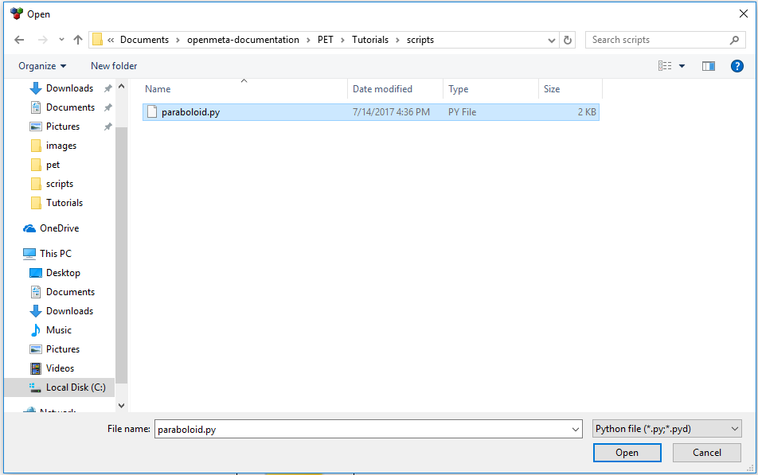
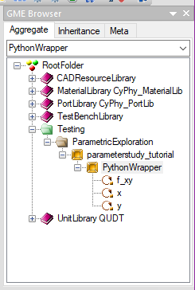

.. _pet_adding_an_analysis_block:

Adding a PET Analysis Block
===========================

At this point in the tutorial, we have created a PET
(**parameterstudy_tutorial**) in GME; however, our PET is empty (and useless).
Let's add a model that we can analyze to **parameterstudy_tutorial**.

1. Locate the **PythonWrapper** within the **Part Browser** window (you may have to
scroll down to find it).

.. caption

2. Left-click on the **PythonWrapper** icon and drag it onto the PET canvas.

.. caption

The PythonWrapper Component allows Python scripts that are formatted to run
within the underlying OpenMDAO framework to be exposed as a block within
OpenMETA. We are going
to model our Paraboloid using a Python script and then load that script into
the PythonWrapper Component in our PET.

.. note:: For more information on OpenMDAO Component scripts and how to write them,
   reference the OpenMDAO documentation: http://openmdao.readthedocs.io/en/1.7.3/usr-guide/basics.html#component

3. Open Notepad (or your favorite text editor) and copy-paste in the code below.

.. highlight:: python
.. :linenothreshold: 5

::

	from __future__ import print_function
	from openmdao.api import Component
	from pprint import pprint

	''' First, let's create the component defining our system. We'll call it 'Paraboloid'. '''
	class Paraboloid(Component):
		''' Evaluates the equation f(x,y) = (x-3)^2 +xy +(y+4)^2 - 3 '''

		def __init__(self):
			super(Paraboloid, self).__init__()

			''' Inputs to the PythonWrapper Component are added here as params '''
			self.add_param('x', val=0.0)
			self.add_param('y', val=0.0)

			''' Outputs from the PythonWrapper Component are added here as unknowns '''
			self.add_output('f_xy', shape=1)

		def solve_nonlinear(self, params, unknowns, resids):
			''' This is where we describe the system that we want to add to OpenMETA '''
			''' f(x,y) = (x-3)^2 + xy + (y+4)^2 - 3 '''

			x = params['x']
			y = params['y']

			f_xy = (x-3.0)**2 + x*y + (y+4.0)**2 - 3.0

			unknowns['f_xy'] = f_xy

			''' This is an equivalent expression to the one above
			unknowns['f_xy'] = (params['x']-3.0)**2 + params['x']*params['y'] + (params['y']+4.0)**2 - 3.0
			'''

4. Select :menuselection:`File --> Save As...`

.. figure:: images/parameterstudy_tutorial_12.png
   :alt: text

5. A **Save As** window will appear. Make a new folder named **scripts** within
your GME project folder.

.. figure:: images/parameterstudy_tutorial_13.png
   :alt: text

6. Save the file as "**paraboloid.py**" within the scripts folder.

.. figure:: images/parameterstudy_tutorial_14.png
   :alt: text

.. note:: If you are using Notepad, make sure **Save as type** is
   set to ``All Files (*.*)``.

7. Return to GME.
8. Double-click on the **PythonWrapper** Component in the PET canvas.

A file explorer will open.

9. Navigate to the location of **paraboloid.py**.
10. Select **paraboloid.py** and click **Open**.

The **PythonWrapper** Component model will change. Notice that the
params and unknowns from the paraboloid.py script are now exposed as
ports on the outside of the **PythonWrapper** Component model.

.. figure:: images/parameterstudy_tutorial_17.png
   :alt: text

Also, remember that the PET's hierarchy can be viewed in the **GME Browser**
window.

