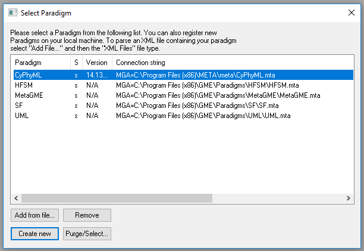
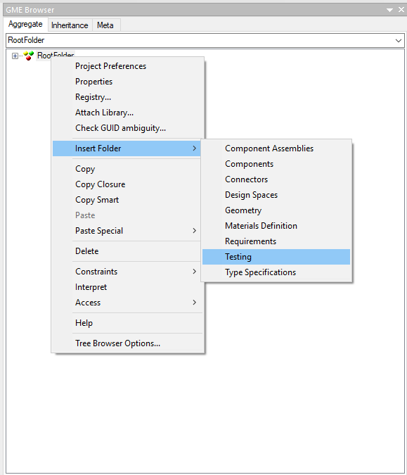
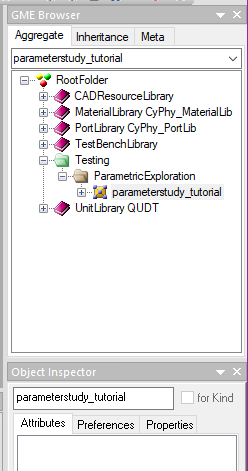

.. _pet_getting_started:

Getting Started
===============

Create a new OpenMETA Project
~~~~~~~~~~~~~~~~~~~~~~~~~~~~~

1. Start GME.
2. Within GME, open the **File** menu and select **New Project...**.

.. figure:: images/parameterstudy_tutorial_1.png
   :alt: Creating a New Project in GME

The **Select Paradigm** menu will popup.

3. Double-click **CyPhyML**.

4. Select **Create project file** and click **Next**.

.. figure:: images/parameterstudy_tutorial_3.png
   :alt: text

5. **Save** the project file as "**parameterstudy-tutorial**".

.. figure:: images/parameterstudy_tutorial_4.png
   :alt: text

Create a new PET within the Project
~~~~~~~~~~~~~~~~~~~~~~~~~~~~~~~~~~~

6. Inside the **GME Browser** window, right-click on the **RootFolder**
and select :menuselection:`Insert Folder --> Testing`.

7. Right-click on the newly created **Testing** folder and select
   :menuselection:`Insert Folder --> Parametric Exploration`.

.. image:: images/parameterstudy_tutorial_6.png

8. Right-click on the newly created **Parametric Exploration** folder
and select :menuselection:`Insert Model --> Parametric Exploration`.

.. image:: images/parameterstudy_tutorial_7.png

9. Double-click on the newly created **ParametricExploration** model
to open it in the main GME window. It should appear as a blank canvas.

.. figure:: images/parameterstudy_tutorial_8.png
   :alt: text

10. Select the **ParametricExploration** model by either left-clicking
on the blank canvas you opened in Step 9 or left-clicking
the **Parametric Exploration** model within the **GME Browser** window
11. Change the name of the model to "**parameterstudy_tutorial**" within the
**Object Inspector** window

