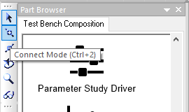
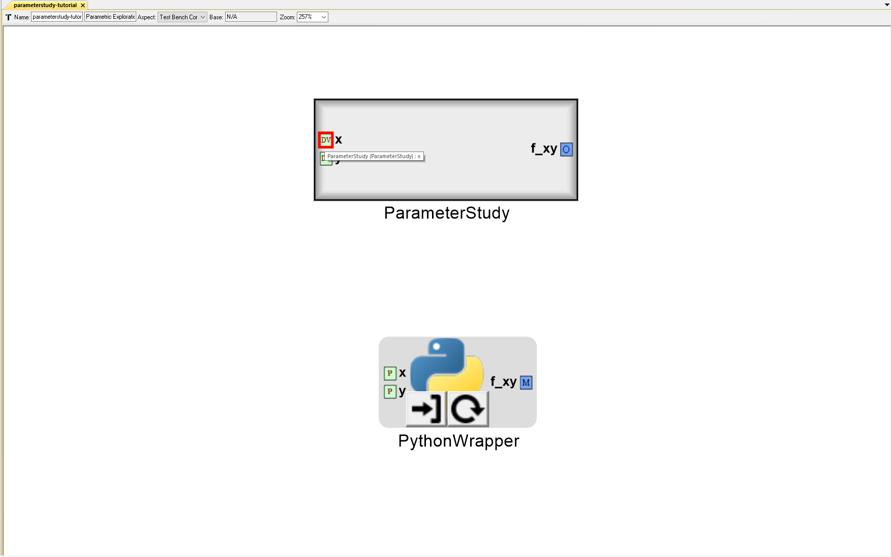
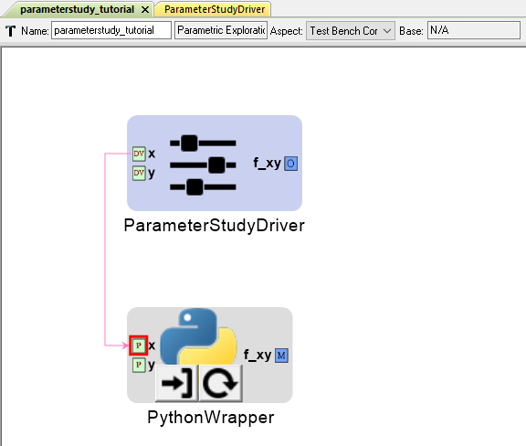
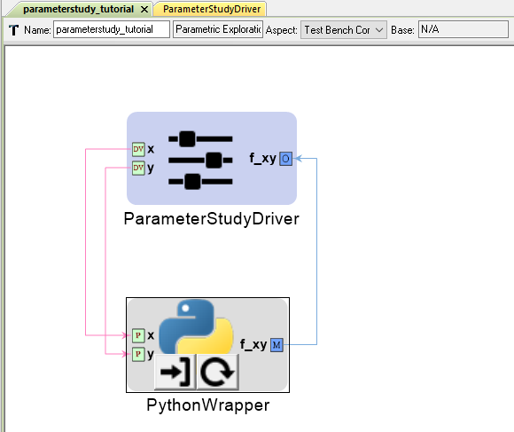
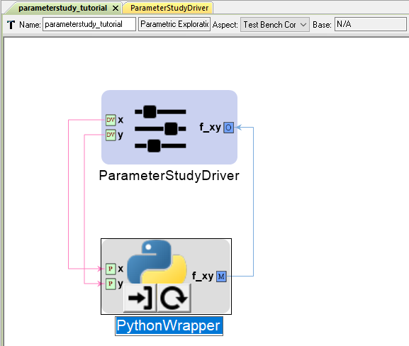
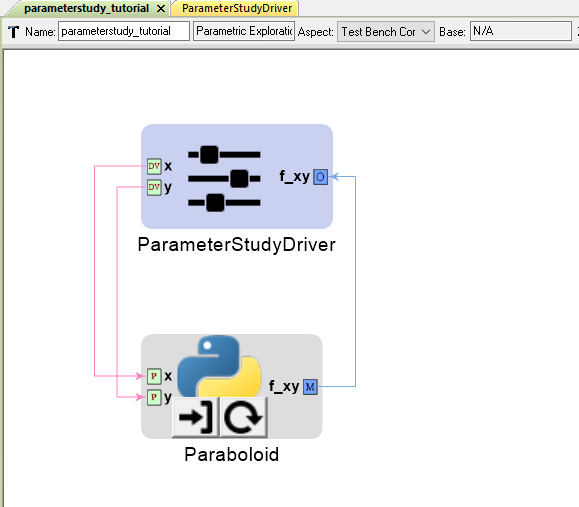

.. _pet_making_connections:

Making Connections within the PET
=================================

Now the PET contains both an Analysis Block and a Driver. The last step before analysis
is to make connections within the PET canvas.

1. Left-click the **Connect Mode** icon on the **Modeling** toolbar. **Connect Mode**
is used to make connections between models on the PET canvas.

2. With **Connect Mode** selected, left-click on **ParameterStudy**'s exposed
Design Variable **x**.

3. Now left-click on **PythonWrapper**'s Parameter **x**.

A line will appear indicating that the two ports are now connected.

4. Connect **ParameterStudy.x** to **PythonWrapper.y**.
5. Connect **PythonWrapper.f_xy** to **ParameterStudy.f_xy**.

Now everything is connected!

6. Let's give the PythonWrapper Component a more descriptive name.
Naming becomes more important from an organizational standpoint
in larger PETs with dozens of Analysis Blocks.

7. Change the PythonWrapper Component's name to **Paraboloid**.

