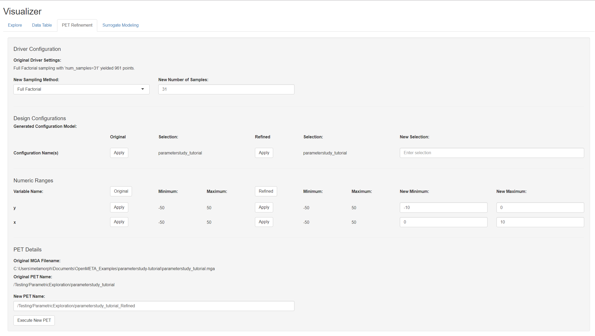
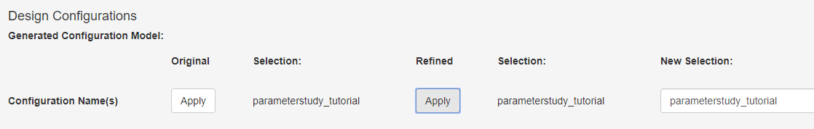
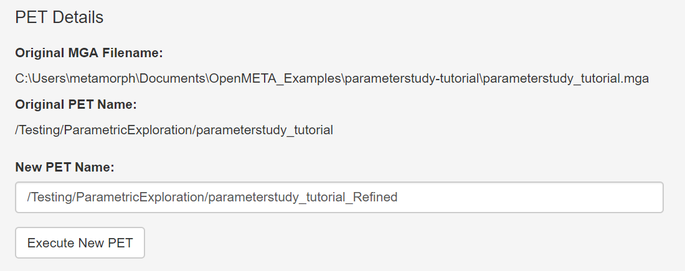

.. _pet_refining_the_pet:

Refining the PET
================

In the previous step, we used the PET Visualizer to estimate the
Paraboloid's global minimum to be located around **(7,-8)**.
If we were analyzing a more complicated function, we might choose
to increase the number of Parameter Study sample points to get a
clearer picture of the design space. In this case, however, we
are confident that our function is smooth and lacking local minima,
so we will instead re-run our PET with the same number of samples
while decreasing the sampled area.

1. Left-click on the **PET Refinement tab** in Visualizer

.. FIXME: I need to update this image after the PET Refinement tab
.. fixes so that the file path to the PET is actually correct.

The **Design Configurations** section enables you to manage your configuration
names. Though our simple design has just one configuration, more complicated
projects may have hundreds.

2. Click ``Apply`` under the **Refined** heading to set the name of your
   refined PET.

The **Numeric Ranges** section enables you to change Design
Variable ranges.

3. Set **x**'s **New Minimum** and **New Maximum** fields to
   **0** and **10** respectively.

4. Set **y**'s **New Minimum** and **New Maximum** fields to
   **-10** and **0** respectively.

.. figure:: images/parameterstudy_tutorial_50.png
   :alt: text

.. FIXME: I need to update this image after the PET Refinement tab
.. fixes so that the file path to the PET is actually correct.

5. Left-click **Execute New PET**

OpenMETA will apply your changes and rerun the PET.
You can see this in the **Results Browser**.

.. FIXME: I need to update this image after the PET Refinement tab
.. fixes so that the file path to the PET is actually correct.

.. figure:: images/parameterstudy_tutorial_52.png
   :alt: text

.. FIXME: I need to update this step after the PET Refinement tab
.. fixes so that the file path to the PET is actually correct.

6. Select **parameterstudy_tutorial (1)** and left-click **Launch in OpenMETA
   Visualizer**.
7. Left-click the **Single Plot** tab.
8. Under the **Variables** section, set **x** as the **X-axis** and **y** as the **Y-axis**.
9. Left-click the **Overlays** section to expand it.
10. Set **f_xy** as the **Contour Variable**.
11. Left-click the **Add Contour Plot** box to check it.

.. figure:: images/parameterstudy_tutorial_53.png
   :alt: text

For numerical solutions, check out the Visualizer's **Data Table**
tab - which allows you to view all the results in table format.
Once you are there, you can sort the results to identify the
minimum **f_xy** value sampled and its corresponding **x** and **y** values.

While the :ref:`parameter_study_driver` is a useful tool for
surveying a design space and can reveal important trends, it is generally
not ideal for optimization problems.

In the next section, we will learn how to use the :ref:`optimizer_driver`
PET Driver, which is often better suited for optimization/minimization problems.
