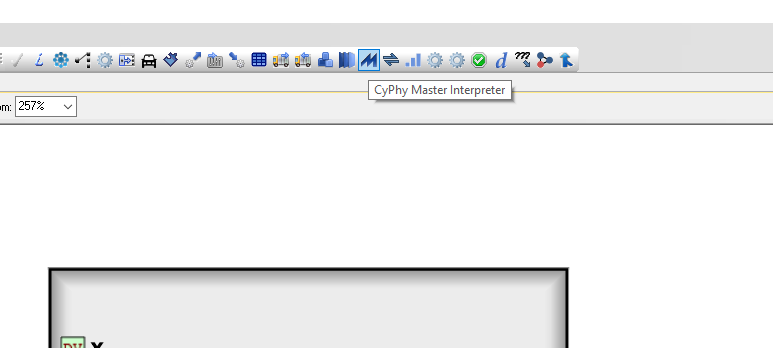
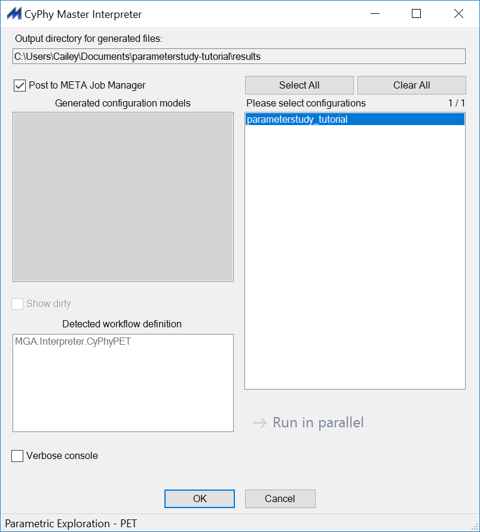
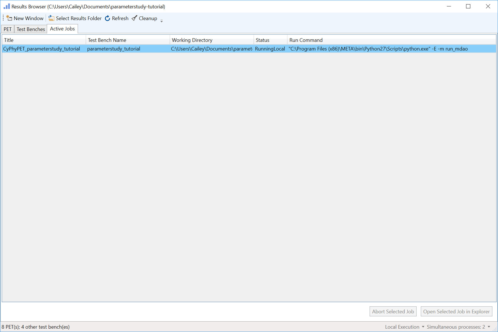
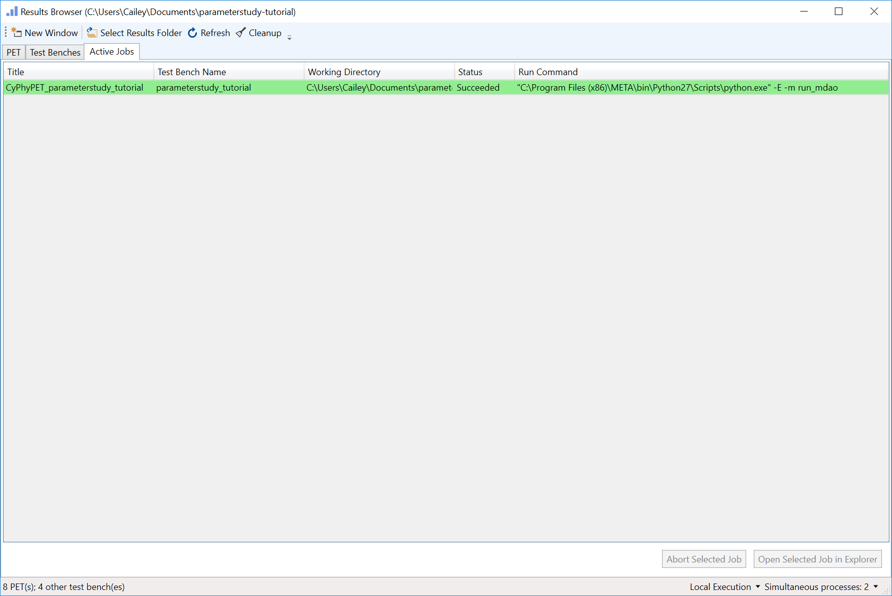
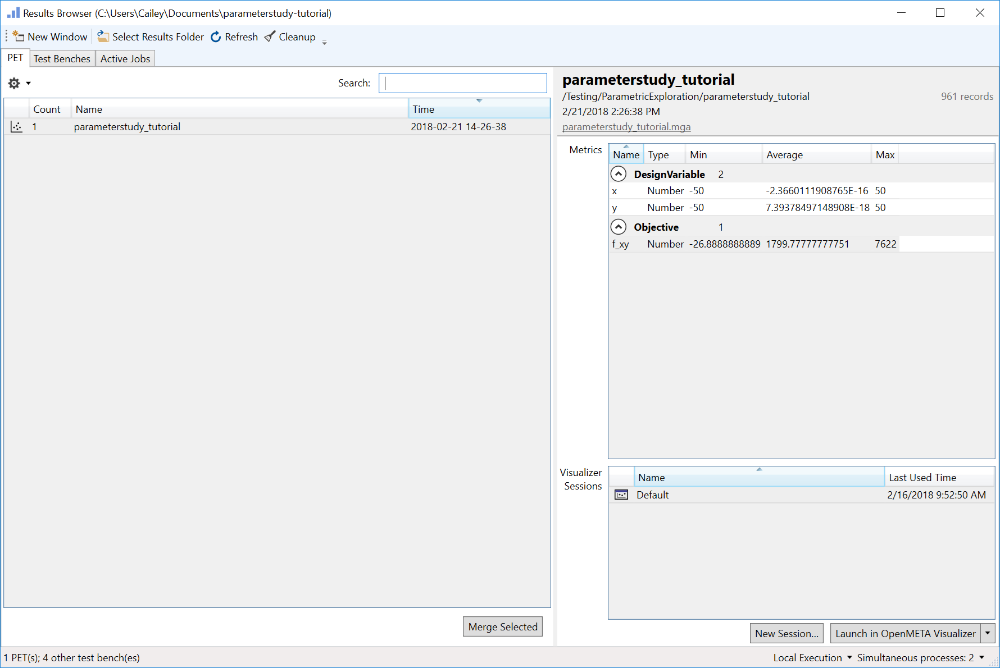
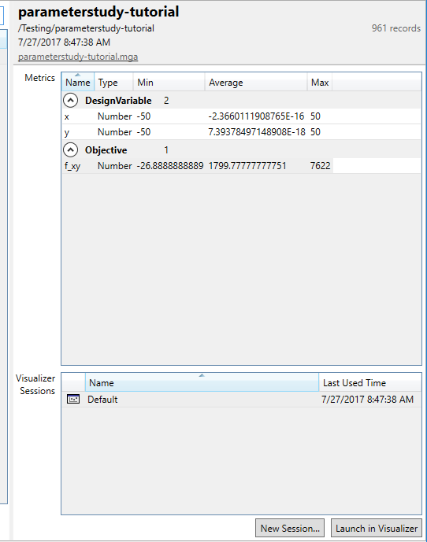

.. _pet_running_the_pet:

Running a PET Analysis
======================

Now that the PET has been set up, we can run it.

1. Left-click on the **CyPhy Master Interpreter** icon
on the **Components** toolbar.

The **CyPhy Master Interpreter** window will open up.

2. Make sure the **Post to META Job Manager** checkbox is selected.
3. Select **OK**.

The **Results Browser** will open up. Our PET is listed under
the **Active Jobs** tab. The Blue shading means that it is running.

When the PET finishes running successfully, its shading will turn green.

.. note:: If the shading is red, then the run failed and a _FAILED.txt
   file with error codes has been generated in the run's folder. To access
   this folder, double-click on the job.

4. Left-click on the **PET** tab within the **Results Browser**.

5. Left-click **parameterstudy_tutorial** to display run information
on the right pane.

You will notice that the details pane on the right of the Results Browser
indicates **961 records** were generated by the run. This is what we expected
from a Full Factorial DOE with 2 Design Variables sampled at 31 levels each.

Under the **Objective** category of the **Metrics** windows, we see that for all
the input combinations the minimum **f_xy** value recorded was -26.89, the
maximum **f_xy** value recorded was 7622, and the average **f_xy** value
recorded was 1799.78.
