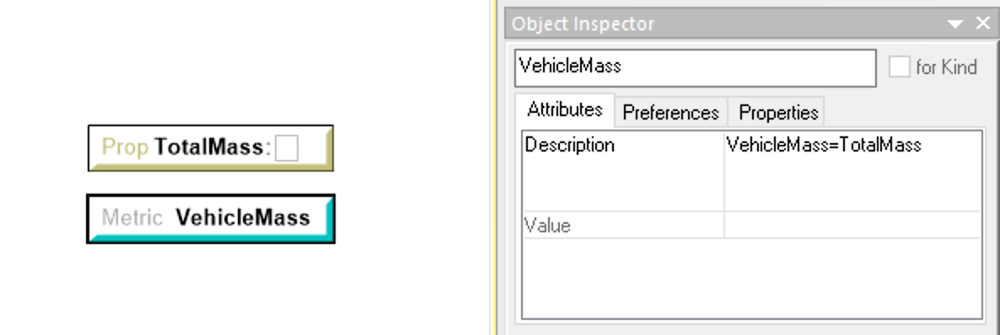

.. _testbench_utilities:

Common Utilities
================

Custom Processor
----------------

Introduction
~~~~~~~~~~~~

In OpenMETA we can pass values between different Parameters and Properties
using *ValueFlow* connections. You can also use SimpleFormula and
ComplexFormula blocks to perform calculations with the values as they are
passed around. When a Test Bench is executed with a Component Assembly as
the *TopLevelSystemUnderTest* reference, the CyPhyFormulaEvaluator runs and 
resolves the values.

We can also use these Value Flow connections to "wire out" values from the
*TopLevelSystemUnderTest* to Metrics in the Test Bench. For example, in
the Test Bench below, three properties from the model of a truck are extracted
to Test Bench Metrics.

.. figure:: images/ExtractPropertiesTestBench.png
   :alt: Test Bench to extract Properties from an OpenMETA Model

   Test Bench to extract Properties from an OpenMETA Model

Depending how few different components and properties you have in your
OpenMETA model, it may be possible to use Value Flow to wire all the needed
values out of your model, but as the complexity of the model increases, it
quickly becomes infeasible to wire out every property you want to extract
from a system model. The **customProcessor.py** script was designed to make
the task of gathering values easier.

Configuring the Test Bench
~~~~~~~~~~~~~~~~~~~~~~~~~~

Each Test Bench must include a reference to a *Workflow*. Workflow
models must reside in a *Workflow Definitions* folder. A Workflow defines
the selection and order of execution for the Interpreters and other scripts
in a Test Bench.

If a Workflow Definitions folder doesn't exist in your Testing Folder, you
can add one by Right-clicking the Testing Folder and selecting:
:menuselection:`Insert Folder --> Workflow Definitions`.

To configure a Workflow to execute the **customProcessor.py** script, follow
the steps below:

#. Add a Task to the *Workflow* by left-click-dragging a **Task** from the 
   GME Part Browser onto the canvas.
   
   .. image:: images/workflow_add_task.png
      :alt: Adding a "Task" to a Workflow Definition
      
      
   
#. Then select **CyPhyPython Interpreter** in the dialog box that appears,
   and click **OK**.

   .. image:: images/workflow_cyphypython.png
      :alt: Selecting the CyPhyPython Interpreter
      
#.  Double-click the resulting Task object and enter "customProcessor.py"
    into the **script** field, then close the window.
    
    .. image:: images/workflow_script_parameter.png
       :alt: Configuring the "script" field.

Querying the Model
~~~~~~~~~~~~~~~~~~

After the Workflow Definition is correctly configured, you can define the
different queries that you want to perform on the model. An OpenMETA
*property* in the Test Bench is required for each query you would like
to perform. The *Description* attribute of the Property is where you will
place the definition of the query.

.. figure:: images/customprocessor_tb_property.png
   :alt: A Test Bench Property with a Custom Processor Query in the Description
   
   A Test Bench Property with a Custom Processor Query in the
   Description

The query takes the form of a comma-separated triplet where the each field
has the following meaning:

1. **name**: The name of the property that will be found in the model.

   -  This name must be an exact match and is case-sensitive.
   
2. **classification**: The classification node used to filter the query.

   -  Each component has a *Classifications* field that is normally
      used to hold the ontological classes to which that component belongs.
      The **classification** field of the query must match one of the 
      nodes defined in the *Classifications* field of the parent component
      of the property. Again, the match must be exact and is case-sensitive.
   -  Leaving the **classification** field blank or using an asterisk signifies
      that there is no restriction based on classification.
      
3. **operator**: the operator field holds the function that is to be applied
   to the values of all the properties that match the **name** and
   **classification** fields of the query. The following operators are
   supported:
   
   +-----------------------+--------------------------------+
   | **Operator**          | **Description**                |
   +-----------------------+--------------------------------+
   | **+** or **SUM**      | Sums all the values            |
   |                       | that are found.                |
   +-----------------------+--------------------------------+
   | **\*** or **SAMPLE**  | Returns the first value that   |
   |                       | is encountered.                |
   +-----------------------+--------------------------------+
   
   
For example, the query in the images above, ``Mass,*,+``, will return
the summation of all the values in properties named "Mass" from the
*TopLevelSystemUnderTest*.

Assigning Queries to Metrics
~~~~~~~~~~~~~~~~~~~~~~~~~~~~

After you have all your queries properly added, you only need to assign
the resulting values to Metrics so they can be recorded and, if executing
in the context of a PET, passed to other analysis blocks.
Similar to the queries themselves, an assignment is accomplished by adding
an assignment statement to the *Description* attribute of a Test Bench
*Metric*.

   
   A Test Bench Metric with a Custom Processor Assignment in the Description

In the image above, you can see that the **Total Mass** that was calculated
with a query is being assigned to the **VehicleMass** metric.

.. note:: These assignments are evaluated in Python and have
   access to all of Python's built-in functions for manipulating numbers as well as the ``math`` module. 
   See `Section 2: Built-in Functions
   <https://docs.python.org/2/library/functions.html#>`_ and `Section 9.2:
   Mathematical functions <https://docs.python.org/2/library/math.html>`_
   of the Python 2.7 Documentation for more information.