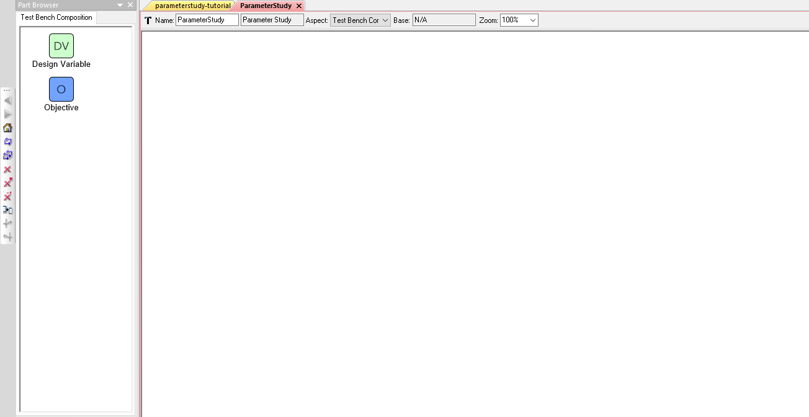
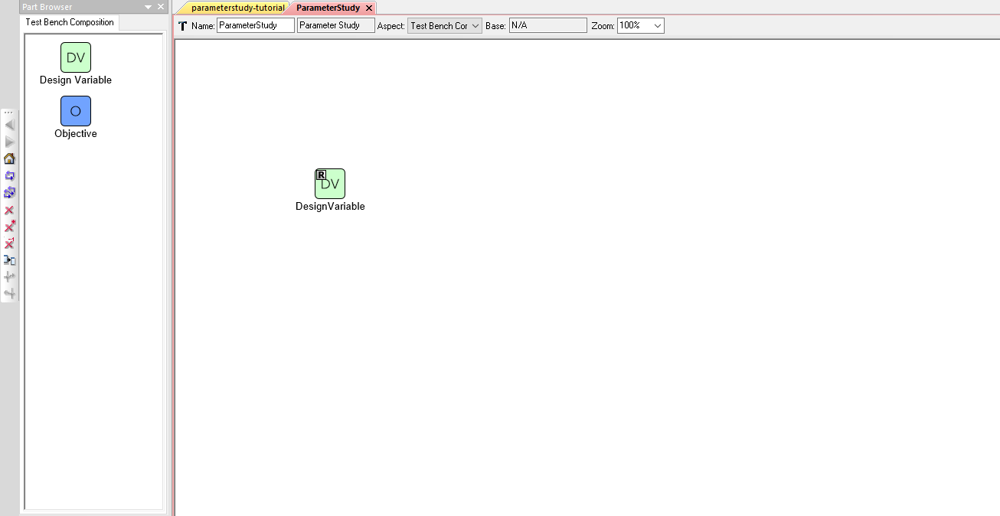
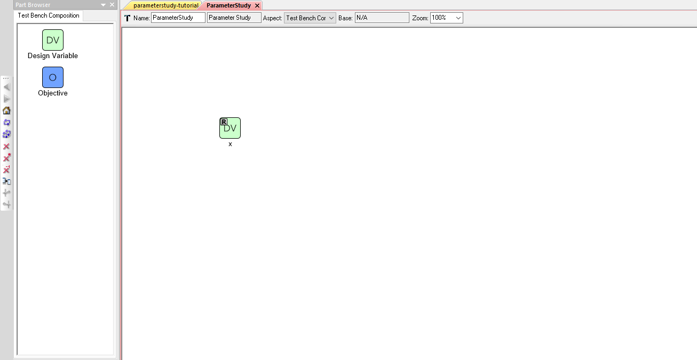
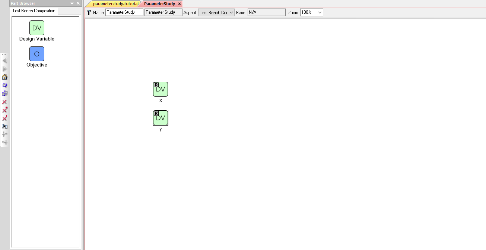
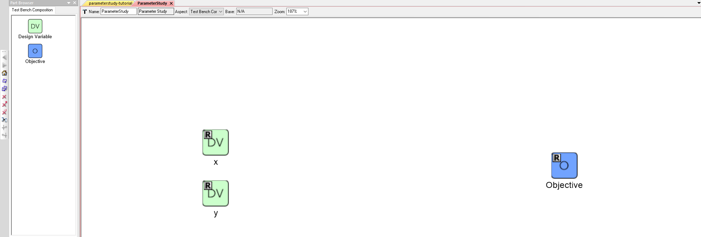
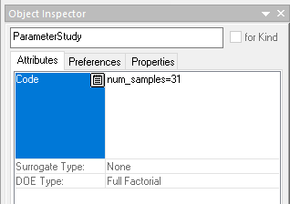
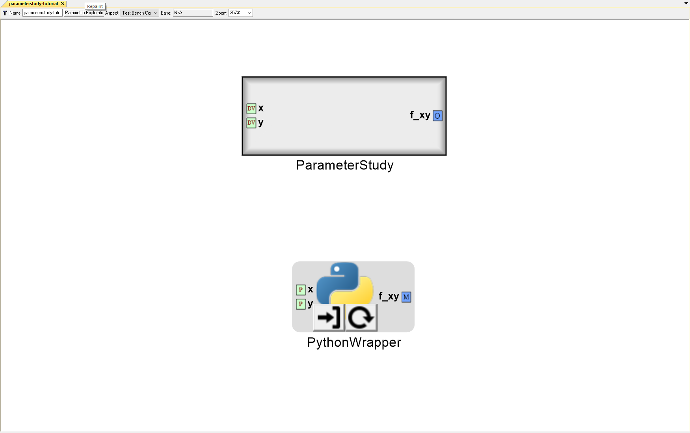

.. _pet_adding_a_driver:

Adding a PET Driver
===================

Adding a Parameter Study Driver to the PET
~~~~~~~~~~~~~~~~~~~~~~~~~~~~~~~~~~~~~~~~~~

1. Left-click on the **ParameterStudy** icon in the **Part Browser** and
drag it onto the PET canvas.

.. figure:: images/parameterstudy_tutorial_19.png
   :alt: text

2. Double-click on the **ParameterStudy** model.

A window with a blank canvas will open up.

.. note:: You can quickly switch between windows via the tabs located
   above the canvas.

We want this ParameterStudy Driver to provide the paraboloid.py script
in the PythonWrapper Component with varying "x" and "y" inputs and then record
the resulting "f_xy" output for each set of inputs.

Add Design Variables to the Driver
~~~~~~~~~~~~~~~~~~~~~~~~~~~~~~~~~~

3. Left-click on the **Design Variable** icon in the **Part Browser** and
drag it onto the ParameterStudy canvas.

4. Left-click the newly added **DesignVariable** to select it.
5. Left-click on the "DesignVariable" label and change it to "x".

.. note:: The name can also be changed in the **Object Inspector** window

6. Left-click on the Design Variable **x** to select it.
7. Locate the **Range** field under **Attributes** in the **Object Inspector** window.
8. Set **x**'s range by entering "**-50,+50**" in the **Range** field.

.. figure:: images/parameterstudy_tutorial_23.png
   :alt: text

9. Repeat Steps 24-29 to add a second Design Variable **y** with a range of
**-50,+50** as well.

.. note:: Zoom in and out of the canvas by rolling the mousewheel while
   holding down :kbd:`control`.

Add an Objective to the Driver
~~~~~~~~~~~~~~~~~~~~~~~~~~~~~~

Now, we need to add an **Objective** to record the output of **paraboloid.py**.

10. Left-click on the **Objective** icon in the **Part Browser** and
drag it onto the ParameterStudy canvas.

11. Change **Objective**'s name to **f_xy**.

.. figure:: images/parameterstudy_tutorial_26.png
   :alt: text

12. Left-click on the **ParameterStudy** canvas to select it.
13. Locate the **Code** field under **Attributes** in the **Object Inspector** window.
14. Enter "**num_samples=31**" in the **Code** field

15. Select **Full Factorial** for **DOE Type:** field.

.. figure:: images/parameterstudy_tutorial_28.png
   :alt: text

We have set our **ParameterStudy** Driver to use a **Full Factorial** method
with 31 samples per independent design variable. Given our two design
variables **x** and **y**, the **ParameterStudy** will conduct a Full Factorial
experiment with 961 total input combinations.

.. note:: If we had selected the **Uniform** DOE Type, the ParameterStudy would
   generate only 31 input combinations (regardless of the number of Design Variables).

.. note:: The **FullFactorial** DOE Type becomes cumbersome as the number of Design Variables
   increases.

   E.g. If there were 6 Design Variables in this examples, then
   **ParameterStudy** would attempt to test 887,503,681 input combinations and probably
   fail due to a memory error!

   As the number of Design Variables increases, it is often
   more efficient to use one of the other DOE Types and/or reduce the size of the design space.

16. Open the **parameterstudy-tutorial** window.

Notice that Design Variables **x** and **y** as well as the Objective **f_xy**
are now exposed as ports on the outside of the ParameterStudy model.

.. note:: Sometimes, changes inside a block such as a Design Variable name change
   are not immediately reflected in the main PET canvas.
   If this happens, left-click the **Repaint** icon on the **Modeling** toolbar
   to manually refresh the canvas.

   .. figure:: images/parameterstudy_tutorial_29_a.png
      :alt: text
