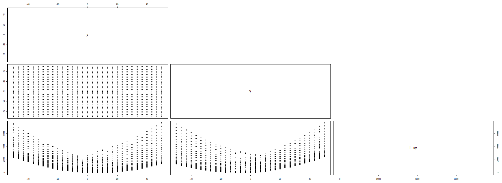
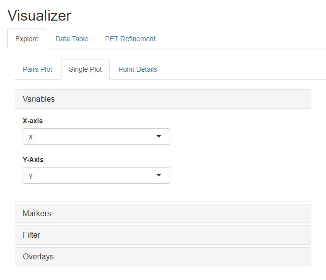
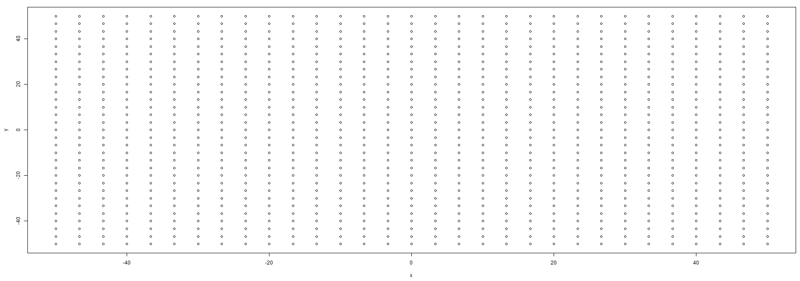
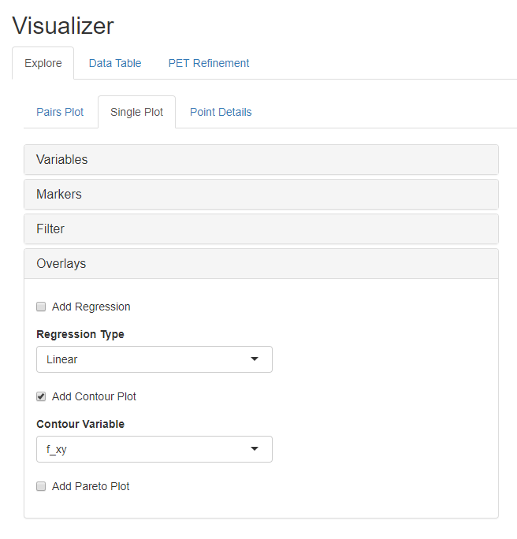

.. _pet_analyzing_the_results:

Using the PET Visualizer
========================

Data from each PET run is stored in a ``.csv`` file in the generated execution
folder in the ``results`` directory;
however, OpenMETA has a built-in data visualizer for analysis and filtering.

1. Left-click **Launch in Visualizer** in the bottom-right corner of the
**Results Browser**.

A browser window will open with the Visualizer.

2. Navigate to the **Pairs Plot** tab of the **Explore** tab.

.. figure:: images/parameterstudy_tutorial_41.png
   :alt: text

3. Clear the default contents of the **Display Variables** field in the **Variables** section.

.. figure:: images/parameterstudy_tutorial_42.png
   :alt: text

4. Add **x**, **y**, and **f_xy** to the **Display Variables** field in that order.

.. figure:: images/parameterstudy_tutorial_43.png
   :alt: text

The resulting Visualizer graph should look like the one below.
The x vs. y plot clearly shows the Full Factorial distribution of **x**
and **y** Design Variable values while the x vs. f_xy and y vs. f_xy plots
suggest that **f_xy**'s minimum is found when both **x** and **y** are near
the middle of their respective ranges.

5. Left-click the **Single Plot** tab of the **Explore** tab.
6. Within the **Variables** section, left-click on the **X-Axis** menu and select **x**.
7. Within the **Variables** section, left-click on the **Y-Axis** menu and select **y**.

Since the **x** and **y** values were selected using a Full Factorial method,
the resulting plot is not very interesting.

8. Left-click on the **Overlays** section of **Single Plot**
9. Select **f_xy** in the **Contour Variable** menu.
10. Check the **Add Contour Plot** box

We have now added a contour plot overlay to our graph.
The graphs shows us that **f_xy** appears to have a global
minimum somewhere around **(7,-8)**.

.. figure:: images/parameterstudy_tutorial_47.png
   :alt: text

For more information on using the OpenMETA Visualizer, check out the
:ref:`visualizer` chapter.
