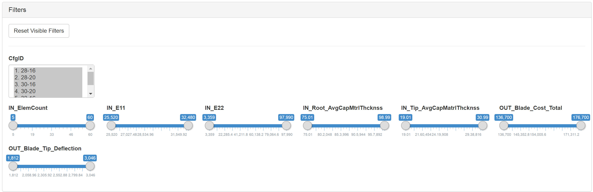
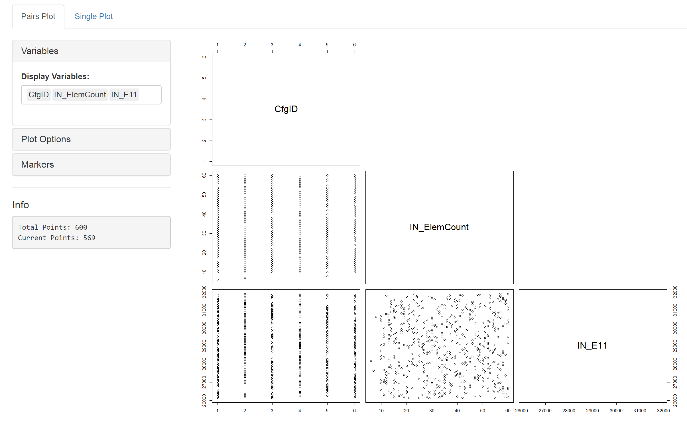
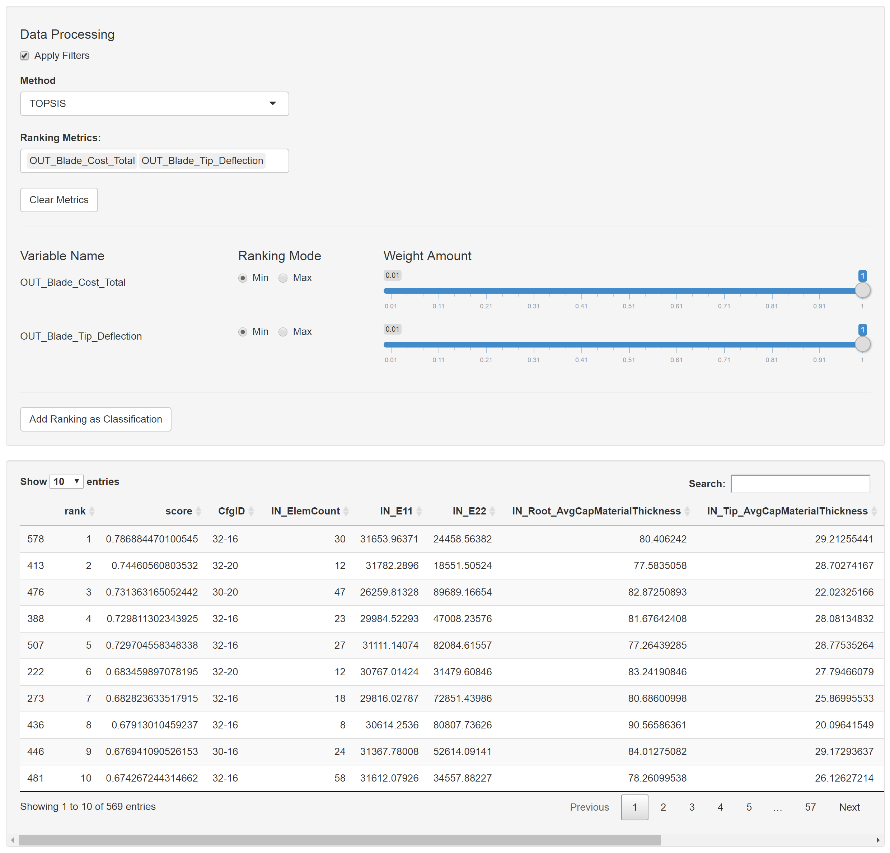
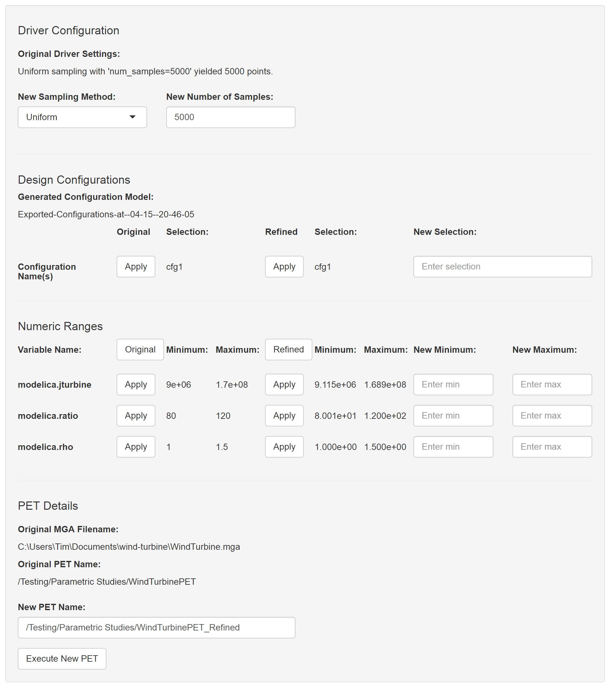

.. _visualizer:

==========
Visualizer
==========

Framework Features
==================

The Visualizer Framework provides an abstraction layer between the
Results Browser and the custom tabs that it hosts. As such it provides
the following services to the tabs:

1. Reads in data and wraps it as a Shiny reactive data frame.
2. Provides a global concept of *Filtered* and *Colored* data that tabs
   can access.
3. Provides a place to save user *Comments* and *Sets*.
4. Gives tabs the ability to add columns to the raw data frame as
   *Classifications*.
5. Saves the session state (including UI inputs and certain data the
   tabs specify) on close and restores the session when the Visualizer
   is later launched from the same config file.

To facilitate interaction with the Visualizer framework itself, a footer
is provided at the bottom of all the tabs that request it. This request
is made by placing a ``footer <- TRUE`` statement in their definition.
For example, the "Histogram.R" example tab below requests this footer.

Filters
-------

The *Filters* panel is the first panel in the Visualizer footer.

-  **View All Filters:** This selects between displaying either filters
   for every variable and classification or just filters for those
   variables currently "selected" in the open tab.

-  **Reset Visible Filters:** This button will return the visible
   filters to their original state, i.e. the full range is selected.

-  **Filters:** These filters exclude from the "Filtered" dataset data
   points that fall outside of the ranges specified for any of the
   variable. Be careful not to exclude all the points in your dataset.

.. image:: images/filter_exact_entry.png
   :alt: Exact Entry
   :width: 408px

-  **Exact Entry Window:** When a slider is 'double-clicked', a new
   window opens up allowing the user to enter an exact range for the
   filter. The window shows the name of the variable along with text
   fields for minimum and maximum range. The 'apply' button applies the
   new values set for the filter; if either or both of the fields are
   left blank or containing non-numeric numbers, they are ignored when
   this button is clicked.

Coloring
--------

.. image:: images/coloring.png
   :alt: Coloring Panel of Visualizer Footer
   :width: 1459px

The *Coloring* panel allows us to apply live and saved colorings to the
data. This information is passed to the tab as an addition column in the
data in the ``data$Colored`` data frame. The "Source" can take one of
three options:

1. **None:** This will assign "black" to the added column in *Colored*.
2. **Live:** This will use the "Live" options that are present here in
   the Coloring Panel to assign the added column in *Colored*.
3. <Saved Colorings>: Different desirable coloring schemes can be saved
   using the "Add Current 'Live' Coloring" button. These colorings will
   be persisted across the live of the session and can be applied by
   selecting them here in the "Source" select input.

Classifications
---------------

.. image:: images/classifications.png
   :alt: Classifications Panel of Visualizer Footer
   :width: 775px

The Visualizer allows for tabs to add additional columns to the dataset.
These added columns are referred to as "classifications." If one of the
tabs selected for the session offers the ability to save
classifications, they will appear here in the *Classifications* panel.

Configuration
-------------

Data Processing
~~~~~~~~~~~~~~~

-  **Remove Missing:** This removes rows from the dataset that are
   incomplete, i.e. one or more entries is missing data.
-  **Remove Outliers:** This option filters out any rows that include
   data more than a certain number of standard deviations away from the
   mean for that variable. The number of standard deviations used for
   filtering can be selected using the slider input.

About
~~~~~

Information about the current version of the app, date of last release,
and support contact information. ## Provided Tabs

There are a number of tabs that are provided to supply functionality out
of the box. Each of these tabs is described below. ### Explore Tab

Provided Tabs
=============

Explore Tab
-----------

The first sub-tab in the *Explore* tab is the *Pairs Plot* tab.

Variables
~~~~~~~~~

-  **Display Variables:** This is where you set what the variables are
   displayed on the main plot

-  **Render Plot:** This button is available only if 'Render
   Automatically' option is unselected. Clicking this button produces a
   plot based on current user settings.

Plot Options
~~~~~~~~~~~~

-  **Render Automatically:** This option causes the pairs plot to
   automatically update anytime a setting is changed. If this box is
   unselected, a ‘Render Plot’ button appears in the *Variables* panel
   where the plot will wait to update until a user clicks this button.
   This is useful when changing the variables for the plot when working
   with a large dataset or relatively large number of variables.
-  **Overlay Trendlines:** Activating this option displays trendlines
   pairs plot.
-  **Display upper panel:** Activating this option displays the upper
   panel as well as the lower panel of the pairs plot.

Markers
~~~~~~~

-  **Plot Markers:** This selects the marker used to create the plot.
-  **Marker Size:** This selects the relative size of each of the
   points.

Export
~~~~~~

-  **Dataset:** Downloads a csv file containing all the data used to
   create the current plot.
-  **Plot:** Downloads a pdf of the plot display.

Info Pane
~~~~~~~~~

This box shows the information about the data set. "Total Points" shows
how many data points are in the set. "Current Points" shows how many
points are being used for plotting.

--------------

The second sub-tab in the *Explore* tab is the *Single Plot* tab.

.. image:: images/explore_single.png
   :alt: Single Plot Tab of the Explore Tab of Visualizer
   :width: 1225px

Variables
~~~~~~~~~

-  **X variable:** Set the variable for the x axis.
-  **Y variable:** Set the variable for the y axis.

Markers
~~~~~~~

-  **Plot Markers:** This selects the marker used to create the plot.
-  **Marker Size:** This selects the relative size of each of the
   points.

Filter
~~~~~~

A user can click and drag a selection on the plot, and once a selection
is made, these buttons will adjust the global filters for the x and/or y
variable to match the range of the selection.

Overlays
~~~~~~~~

-  **Add Pareto Plot:** This enables the addition of a pareto plot and
   allows you to specify the objectives.
-  **Add Contour Plot:** This enables the addition of a contour plot and
   allows you to specify the third variable for the contour.

Near Points Info
~~~~~~~~~~~~~~~~

By clicking on the graph, data points near the click will display their
info in this panel.

Data Table Tab
--------------

Data Processing
~~~~~~~~~~~~~~~

-  **Apply Filters:** This checkbox determines whether you are looking
   at the raw data or data with the global filters applied.
-  **Method:** This select input allows you to select the method, if
   any, that is used to process the data. Currently the only method that
   is available is the TOPSIS.

TOPSIS
~~~~~~

The Technique for Order of Preference by Similarity to Ideal Solution
(TOPSIS) is a multi-criteria decision analysis method, which was
originally developed by Hwang and Yoon in 1981 with further developments
by Yoon in 1987, and Hwang, Lai and Liu in 1993. (Wikipedia) We rely
upon the implementation available in the 'topsis' package on CRAN.

-  **Ranking Metrics:** This select input allows the user to specify the
   metrics of interest.
-  **Clear Metrics:** Clicking this button resets this tab.
-  **Ranking Mode:** This specifies the objective for each of the
   variables.
-  **Weight Amount:** This specifies the relative weight of each
   objective.

The *rank* and *score* columns appear when data ranking is being used.
The table is sorted by ascending rank. A score between 0 and 1 is
assigned to each point based results of the TOPSIS analysis.

Adding Classifications
~~~~~~~~~~~~~~~~~~~~~~

This allows the user to add the ranking column to the global dataset as
a *classification*.

Data Table
~~~~~~~~~~

The data table itself is interactive and can be sorted and searched.

PET Refinement Tab
------------------

Driver Configuration
~~~~~~~~~~~~~~~~~~~~

-  **New Sampling Method:** 'FullFactorial' or 'Uniform'

-  **New Number of Samples:** An argument that specifies the number of
   samples.

Design Configuration
~~~~~~~~~~~~~~~~~~~~

This section allows the user to choose only certain configurations to
run for the next PET.

Numeric Ranges
~~~~~~~~~~~~~~

-  **Original Numeric Ranges:** This section displays the min and max
   value, for each variable, before any filtering has been applied.
   Clicking ‘Original’ inserts all these value to the New Ranges
   (whereas clicking 1 apply adds the ‘new’ value for just a single
   row).

-  **Refined Numeric Ranges:** This section displays the min and max
   value, for each variable, post-filtering. Clicking ‘Refined’ inserts
   all these value to the New Ranges (whereas clicking 1 apply adds the
   ‘new’ value for just a single row).

-  **New Numeric Ranges:** This section can be populated with the listed
   values using the appropriate 'Apply' button or new min and max values
   for each variable can be set manually.

PET Details
~~~~~~~~~~~

-  **New PET Name:** This name will be applied to the PET after is
   copied from the old one.

Execute New PET
~~~~~~~~~~~~~~~

Clicking the 'Execute New PET' button will cause a new PET to be started
with the Master Interpreter and dispatched to the Active Jobs tab in the
Results Browser.

Uncertainty Quantification Tab
------------------------------

The Uncertainty Quantification Tab serves as a tool to analyze data
using probabilistic concepts.

Weighting Tab General Configuration
~~~~~~~~~~~~~~~~~~~~~~~~~~~~~~~~~~~

.. image:: images/uq_weighting_config.png
   :alt: Uncertainty Quantification Weighting Tab Configuration Options
   :width: 1220px

-  **Display All Variables:** Checking this box sets all the variables
   in the data set to appear in the bayesian tab.
-  **Display Variables:** When ‘Display All Variables’ is deselected,
   this select input allows the user to specify which variables they
   would like to display.

Weighting Tab Variable Configuration
~~~~~~~~~~~~~~~~~~~~~~~~~~~~~~~~~~~~

.. image:: images/uq_weighting_variables.png
   :alt: Uncertainty Quantification Weighting Tab Variable Options
   :width: 1220px

-  **Variable Type:** This drop down list sets the type of variable,
   i.e. 'Input' or 'Output'.
-  **Reshape to Gaussian:** This checkbox along with the σ and μ input
   boxes specifies that the user would like the data to be resampled
   using the normal probability distribution specified.

Weighting Tab Variable Plots
~~~~~~~~~~~~~~~~~~~~~~~~~~~~

The plots for each of the variables are display immediately to the right
or the variable options. Below is a legend for the plots; the default
color for each element is listed in parentheses.

-  **Plot Frame:** This will be 'Yellow' for 'Inputs' and 'Blue' for
   'Outputs.'
-  **Histogram (Wheat):** This histogram represents the raw data before
   any shaping/resampling.
-  **Reshaping Distribution (Black):** This is the weighting
   distribution used to resample the data.
-  **Resampled Distribution (Green):** This is the resampled
   distribution.
-  **Posterior Distribution (Orange):** This is posterior distribution
   after Forward Uncertainty Quantification has been performed.

At the bottom of the variable configuration is the **Run Forward UQ**
button. This will perform a forward uncertainty quantification on the
data and add a posterior distribution to the output plots. Note at least
one "Enable Constraint" checkbox must be checked for forward uncertainty
quantification to run successfully.

Probability Queries
~~~~~~~~~~~~~~~~~~~

.. image:: images/uq_probability_queries.png
   :alt: Uncertainty Quantification Probability Queries
   :width: 1225px

This section allows us to evaluate the integration of the area under the
resampled distributions below or above a certain threshold. These
probabilities are used additionally in the *Design Ranking* Tab to rank
the designs.

Design Ranking Tab
~~~~~~~~~~~~~~~~~~

.. image:: images/uq_design_ranking.png
   :alt: Uncertainty Quantification Design Ranking Tab
   :width: 1227px

The design ranking tab uses the 'TOPSIS' package on CRAN to perform a
multi-criteria decision making optimization on the result of performing
all of the queries on all of the different design configurations
present. This allows the user to rank the designs based on the queries.

-  **Weights:** The Weights sections allows you to specify the relative
   importance of each of the queries.
-  **Rankings:** The rankings are displayed in a table.

Custom Tabs
===========

The Visualizer framework is extensible and allow one or more
user-defined tabs to rendered in a given instance of the Visualizer. The
Visualizer is built using the statistical programming language
`R <https://www.r-project.org/>`__ and a package called
`Shiny <https://shiny.rstudio.com/>`__. When an instance of the
Visualizer is launched, it consumes a config file that specifies both
the data and the references to the desired tabs for that instance. Each
tab is in turn implementeded as a single Shiny module in a .R file that
includes the definition of both the UI and the backend functionality of
a tab.

Basic Tab Structure
-------------------

The basic structure of a custom tab is very simple. It must have the
following variable and function definitions present to be valid:

-  ``title``: This variable should be the desired title of the tab in
   the UI as a string.
-  ``footer``: This variable should specify whether or not you want the
   Visualizer framework footer to be visible when this tab is opened. It
   will either be ``TRUE`` or ``FASLE``.
-  ``ui(id)``: This function should have only the ``id`` parameter and
   return the output of a Shiny UI function, e.g. fluidPage(), that
   defines the desired UI.
-  ``server(input, output, session, data)``: This function is passed the
   following parameters:

-  ``input``: This is the Shiny 'input' list. You will use this to
   access inputs generated in the UI.
-  ``output``: This is the Shiny 'output' list. You will use this to
   assign values to outputs referenced in the UI.
-  ``session``: This is the Shiny 'session' object. It is used to access
   the 'ns' function and is consumed by some of the advanced Shiny
   functions.
-  ``data``: This data frame includes the raw data that was passed to
   the Visualizer by the Results Browser as well as a host of other
   relevant metadata about the dataset. See below for more infomation.

The 'data' Object
-----------------

Upon launch, the Visualizer Framework builds an R data frame that
includes the raw data and other useful metadata. The visualizer manages
this data frame for the most part, and each of the custom tabs should
only enjoy limited write-access to it.

The data object contains all the information that a tab needs to
interact with the data and any of the other features that are provided
by the Visualizer framework. Below is a mapping of the data structure
with an explanation for each of the objects.

-  ``data`` - contains all the passed objects
-  ``Colored`` - the filtered data that has an added ‘color’ column
-  ``Filtered`` - the raw data that has been filtered by the different
   UI elements in the “Filters” section
-  ``Filters`` - the state of each of the sliders, selectInputs etc. in
   the “Filters” section of the Visualizer UI.

   -  ``<variable names>``
   -  ``type`` - the “R” data-type of the variable, e.g. ‘factor,’
      ‘integer,’ or ‘numeric’
   -  ``selection`` - (if type is ‘factor’), list of all selected
      choices
   -  ``min``, ``max`` - (if type is ‘integer’ or ‘numeric’)

-  ``meta``

   -  ``coloring``
   -  ``<coloring names>``

      -  ``name`` - name of the coloring scheme
      -  ``type`` - ‘Max/Min’ or ‘Discrete
      -  ``var`` - the name of the variable that is the basis of the
         coloring
      -  ``goal`` - (for ‘Max/Min’) ‘Maximize or ‘Minimize’
      -  ``palette`` - (for ‘Discrete’) ‘Rainbow,’ ‘Heat,’ ‘Terrain,’
         ‘Topo,’ or ‘Cm’
      -  ``rainbow_s`` - (if ‘Rainbow’ for palette) the saturation for
         the palette
      -  ``rainbow_v`` - (if ‘Rainbow’ for palette) the value/brightness
         for the palette

   -  ``current``

      -  ``name`` - name of the coloring scheme
      -  ``type`` - ‘Max/Min’ or ‘Discrete’
      -  ``var`` - the name of the variable that is the basis of the
         coloring
      -  ``goal`` - (if type is ‘Max/Min’) ‘Maximize’ or ‘Minimize’
      -  ``colors`` - (if type is ‘Discrete’, list) the list of the
         colors used for each variable

   -  ``comments`` [Not yet implemented]
   -  ``<comment ids>``

      -  ``id`` - a guid associated with the comment
      -  ``username`` - the username of the user who wrote the comment
      -  ``date`` - the date the comment was added
      -  ``text`` - a guid associated with the comment
      -  ``object`` - (optional) the object(s) referenced in the comment

   -  ``pet`` - contains information about the PET that generated these
      results
   -  ``sampling_method`` - (string) ‘Full Factorial,’ ‘Central
      Composite,’ ‘Opt Latin Hypercube’, or ‘Uniform’
   -  ``num_samples`` - (integer) the ‘num\_samples’ value from the
      ‘code’ field in the OpenMETA model
   -  ``pet_name`` - (string) the name of the ‘Parametric Exploration’
      in the OpenMETA model
   -  ``mga_name`` - (string) the name of the .mga file within which the
      PET resides
   -  ``generated_configuration_model`` - (string) the name of the
      ‘Generated Configuration Model’ created by the DESERT tool that
      was selected for the execution of this PET
   -  ``selected_configurations`` - (list) the names of each of the
      configurations that were chosen for this PET execution
   -  ``design_variable_names`` - (list) the names of all variables that
      were of type ‘Design Variable’
   -  ``design_variables`` - (list) detailed information about the
      variables that were of type ‘Design Variable’
   -  ``objective_names`` - (list) the names of all variables that were
      of type ‘Objective’
   -  ``pet_config`` - (data frame) the parsed pet\_config.json file.
   -  ``pet_config_filename`` - (string) the filename of the
      'pet\_config.json' file relative to the location of the
      'visualizer\_config.json' file.
   -  ``sets`` [Not yet implemented]
   -  ``<set names>``

      -  ``name`` - name of the set
      -  ``username`` - the username of the user who created the set
      -  ``date`` - the date the set was added
      -  ``objects`` - the different objects in the set, most often
         design configurations

   -  ``variables``
   -  ``<variable names>``

      -  ``name`` - corresponds to variable in ``data$raw`` df
      -  ``name_with_units`` - unit appended in parentheses
      -  ``type`` - 'Unknown', ‘Design Variable’, ‘Objective’, or
         'Classification'
      -  ``username`` - the username of the user who wrote the comment
      -  ``date`` - the date the comment was added

-  ``pre`` - basic preprocessing reactives to simplify interaction with
   the data

   -  ``var_names()`` - (list) original names of all the variables in
      the input data set
   -  ``var_class()`` - (list) the class (or type) of each of the
      variables
   -  ``var_facs()`` - (list) names of all the variables of class
      ‘factor’
   -  ``var_ints()`` - (list) names of all the variables of class
      ‘integer’
   -  ``var_nums()`` - (list) names of all the variables of class
      ‘numeric’
   -  ``var_nums_and_ints()`` - (list) names of all the variables of
      class ‘numeric’ or ‘integer’
   -  ``abs_max()``, ``abs_min()`` - (list) the maximum and minimum
      values for each variables in var\_nums\_and\_ints
   -  ``var_range_nums_and_ints()`` - (list) names of all the variables
      of class ‘numeric’ or integer’ that vary across some range, i.e.
      are not constants
   -  ``var_range_facs()`` - (list) names of all the variables of class
      ‘factor’ that vary across some range, i.e. are not constants
   -  ``var_range()`` - (list) names of all variables that vary across
      some range, i.e. are not constants
   -  ``var_range_nums_and_ints_list()`` - (list of lists)
      ``var_range_nums_and_ints()`` sorted into lists by type.
   -  ``var_range_facs_list()`` - (list of lists) ``var_range_facs()``
      sorted into lists by type.
   -  ``var_range_list()`` - (list of lists) ``var_range()`` sorted into
      lists by type.
   -  ``var_constants()`` - (list) names of the variables of any class
      that don’t vary in the dataset.

-  ``raw$df`` - the raw data with no filtering or coloring applied as a
   reactive value.

E.g. In your ``server`` function, you could find the type of the first
variable by evaluating ``data$meta$variables[[1]]$type``. You could also
find a list of all the variables that are factors, i.e. discrete
choices, in the ``data$raw$df`` data frame by evaluating
``data$pre$var_facs()``

Histogram Example Tab
---------------------

Below is an example tab definition .R file.

.. code:: R

     1|title <- "Histogram"
     2|footer <- TRUE
     3|
     4|ui <- function(id) {
     5|  ns <- NS(id)
     6|  
     7|  fluidPage(
     8|    br(),
     9|     column(3,
    10|      selectInput(ns("variable"), "Histogram Variable:", c())
    11|    ),
    12|    column(9,
    13|      plotOutput(ns("plot"))
    14|    )
    15|  )
    16|  
    17|}
    18|
    19|server <- function(input, output, session, data) {
    20|  ns <- session$ns
    21|  
    22|  observe({
    23|    selected <- isolate(input$variable)
    24|    if(is.null(selected) || selected == "") {
    25|      selected <- data$pre$var_range_nums_and_ints()[1]
    26|    }
    27|    saved <- si_read(ns("variable"))
    28|    if (is.empty(saved)) {
    29|      si_clear(ns("variable"))
    30|    } else if (saved %in% c(data$pre$var_range_nums_and_ints(), "")) {
    30|      selected <- si(ns("variable"), NULL)
    31|    }
    32|    updateSelectInput(session,
    33|                      "variable",
    34|                      choices = data$pre$var_range_nums_and_ints_list(),
    35|                      selected = selected)
    36|  })
    37|  
    38|  output$plot <- renderPlot({
    39|    req(input$variable)
    40|    hist(data$Filtered()[[input$variable]],
    41|         main = paste("Histogram of" , paste(input$variable)),
    42|         xlab = paste(input$variable))
    43|  })
    44|  
    45|}

The ``title`` of the tab is assigned on line 1. On line 2 we specify
that we want to display the Visualizer footer when this tab is open.

The UI for this example tab, defined in ``ui(id)`` on lines 4-17, is
simply a select box for the user to choose which variable to process for
the histogram and a placeholder for the histogram plot itself; the
select box ``inputId`` and plot ``outputId`` are 'variable' and 'plot',
respectively. The Visualizer framework implements the Shiny 'Module'
concept to isolate the tabs and avoid input name collisions; this
necessitates the ``ns <- NS(id)`` statement at the beginning of the
function and the wrapping all the ``inputId`` and ``outputId``
parameters to Shiny UI function calls in a call to ``ns()``.

The ``server`` function, defined on lines 19-45, is where we describe
the backend processing that produces plots and other outputs for the UI.

The body of this function begins by assigning the local namespace
function (``session$ns``) to ``ns`` on line 20. Although you do not need
to call ``ns()`` when accessing variables from ``input``, e.g. the
``input$variable`` reference on line 42, you do need to wrap
``inputId``\ s and ``outputId``\ s as we did in the UI definition above
when they are being created or updated.

It then implements an ``observe()`` call on lines 22-36 to properly
update the options presented to the user in the "Histogram Variable"
select box. In Shiny, an ``observe()`` provides a mechanism for
re-running a block of code when any of the reactive variables referenced
within that code are initialized or changed. In this case we want to
update the choices presented in the 'variable' Select Input anytime the
non-constant, numeric or integer variables in our dataset change. (This
occurs when the data is initialized or classifications are added or
removed.)

This code block is fairly complex, but it provides a lot of
functionality: it specifies a default value, if loads a value saved from
a previous session, and updates the 'variable' UI element dynamically as
the dataset is altered. The ``selected`` variable is first assigned the
current value of the input. This is done within an ``isolate()`` call
which breaks the reactive dependency on the input value; without the
``isolate()`` our code block would be executed every time the user
changed the input. Next we assign a default value if it is currently
null or empty, .e.g. when the Visualizer is launched for the first time.
Then we use the ``si_read()`` function to check if there is a saved
value for this input from a previous session of the visualizer. (Note
the use of the ``ns()`` call around our input name.) The ``is.empty()``
function is a custom function that evaluates to true if the value is
either null or an empty list(). To cover the case of it being an empty
list, we clear the saved value as it would prevent saving the value of
this input upon closing the current session. The final if statement
ensures that the saved choice is in the currently available options
before applying the value. Lastly we call ``updateSelectInput`` to
update the input with our new values.

The final section of code on lines defines the 'plot' output to be a
histogram of the variable selected in the "Histogram Variable" select
box with a title and x-axis label. The ``req()`` function allows us to
break if a needed input is ``NULL`` as is the case with
``input$variable`` before the dataset is initialized and all the
reactive dependencies are sorted out.

The rendered tab looks like this:

.. image:: images/histogramTab.png
   :alt: Example Histogram Tab
   :width: 1110px

This example can be found at
``C:\Program Files (x86)\META\bin\Dig\tabs\Histogram.R`` (or wherever
you installed OpenMETA) and used as the basis for creating tabs of your
own.

Adding Your Own Tab
-------------------

Creating the File
~~~~~~~~~~~~~~~~~

Navigate to ``C:\Program Files (x86)\META\bin\Dig\tabs\`` to see all the
currently configured user-defined tabs. Each file here corresponds to a
single tab in the Visualizer. To create a tab of your own simply copy
the example tab from ``./examples`` to this folder and modify it to suit
your needs. The next time you launch the Visualizer, your tab will be
included in the tabset.

*Note: The tabs are added in the order that they appear in this
directory, so it may be useful to prepend an number to the filename.*

Developing your Application
~~~~~~~~~~~~~~~~~~~~~~~~~~~

We recommend using `RStudio <https://www.rstudio.com/>`__ to develop
your custom tabs. It offers syntax highlighting, code completion, and
debugging support. After downloading and installing the software, you
should be able to open the ``Dig.Rprog`` project file at
``C:\Program Files (x86)\META\bin\Dig\`` and launch the Visualizer
directly from RStudio.

To enable breakpoints in RStudio in your tab file code you will have to
uncomment (Ctrl-Shift-C) the ``debugSource`` call towards the top of
``server.R`` file.

.. code:: R

    170|# Source tab files
    171|print("Sourcing Tabs:")
    172|tab_environments <- mapply(function(file_name, id) {
    173|    env <- new.env()
    171|    if(!is.null(visualizer_config$tab_data)) {
    175|      env$tab_data <- visualizer_config$tab_data[[id]]
    176|    } else {
    177|      env$tab_data <- NULL
    178|    }
    179|    source(file_name, local = env)
    180|    # debugSource(file_name, local = env)
    181|    print(paste0(env$title, " (", file_name, ")"))
    182|    env
    183|  },
    184|  file_name=tab_files,
    185|  id=tab_ids,
    186|  SIMPLIFY = FALSE
    187|)
