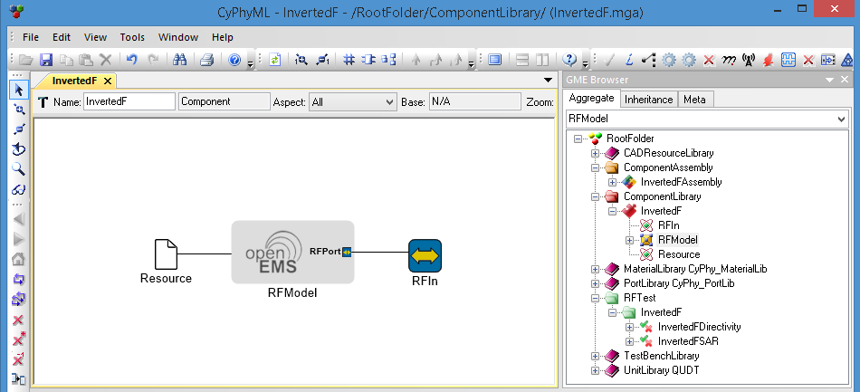
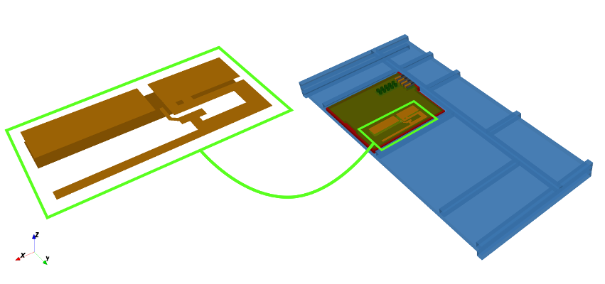
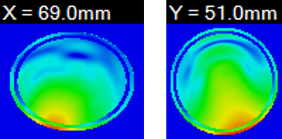

- - -
## RF Analysis: 2.4 GHz Inverted-F Antenna

<!-- Adam: When to use CyPhy or META? -->

This section presents a case study of the RF Analysis capability of the META tools using a 2.4 GHz Inverted-F antenna example model. It shows the usage of the META RF models and testbenches.

The physical dimensions and the material properties of the generated RF model are based on the ARA prototype module templates described in the ARA MDK v0.11 reference materials.

### Resources

The example model of the Ara module mounted Inverted-F antenna relies on the following files:

| Filename | Description |
| :--- | :---------- |
| InvertedF.xme | A META project that models the Ara prototype endo, module and the Inverted-F antenna. |
| InvertedF.xml | Geometrical and material description of the antenna. |

See the **Downloads** table at the bottom of the [Installation and Setup](@ref installation-and-setup) page for a link to download this example project.

### Model and Test Bench Overview

#### InvertedFAntenna (Component)

The Component model of the Inverted-F antenna comprises an *RFPort*, an *RFModel* and a *Resource* file as shown below:

<i>The Inverted-F antenna CyPhy model.</i>

 ***RFPort*** represents the input port of the antenna, thus has its ***Directionality*** attribute set to <i>"in"</i>. ***RFModel*** stores the placement information about the antenna geometry, described in the linked ***Resource*** file, such as its X and Y position and rotation. The origin of the coordinate system is the top-side corner of the PCB closest to the EPM(s). The concept is illustrated below:

<!-- _NOTE: The X and Y coordinates are set manually currently, but are expected to be set based on the layout file in the future.
 -->

<i>The Inverted-F antenna with ground planes "mounted" on a 2x2 Ara module.</i>

Note that the antenna may be of arbitrary 3D shape and is not limited to PCB antennas.

#### InvertedFAssembly (Component Assembly)

The *Component Assembly* for the example model contains only the ***InvertedF*** antenna model connected to an _RFPort_ with its ***Directionality*** attribute set to <i>"in"</i>.

#### Excitation (Test Component)

This *Test Component* in the example design embodies the excitation for the Inverted-F antenna. It generates a 50 Ohm lumped-element resistor and the necessary voltage and current probes at the feed point, that is, between the bottom and the top of the PCB at the location defined in the attributes of the Inverted-F antenna model. During simulation it applies a 100~MHz bandwidth Gaussian excitation signal with the center frequency specified in the ***Frequency*** testbench parameter.

### Usage

Performing an antenna analysis consists of the following simple steps. In the example model, steps 1-3 have already been done for you.

1. Make a copy of the desired testbench found under `TestbenchLibrary / RF` and adjust its name if necessary. In the example model, this has already been done: ***Directivity*** and ***SAR*** were copied to `RFTest / InvertedF` and renamed to ***InvertedFDirectivity*** and ***InvertedFSAR***, respectively.
2. Create a reference to the component assembly to be tested, and connect it to the ***Excitation*** test component. In the example model, this has already been done using the ***InvertedF*** component assembly.
3. Configure the testbench parameters. See [CyPhy2RF interpreter parameters](@ref rf-interpreter-parameters) for details. In the example model, this has already been done for you.
4. Make the testbench the active GME tab and invoke the master interpreter by clicking on its icon. See [Using Test Benches](@ref using-test-benches) for details on configuring and running **Test Benches**.
5. Find and inspect the produced analysis results in the folder indicated in the GME console. The results will be available once the analysis finishes running within the **Job Manager**.

#### Command-line Interface

An alternative approach to perform RF analysis is to use the _AraRFAnalysis.exe_ command line tool. Assuming that the _InvertedF.xml_ antenna description is found in the current directory, invoking the tool with the following parameters

    "c:\Program Files (x86)\META\bin\AraRFAnalysis.exe" -x 20 -y 32 -r 0 --no-endo --module-size 2x2 InvertedF.xml

produces the same results as the execution of the above ***InvertedFDirectivity*** test bench. The mandatory parameters include the size of the Ara module (2x2), the path to the antenna model (InvertedF.xml) and its position (x = 20, y = 32) and rotation (r = 0&deg;) in the module, relative to the top-side edge of the PCB closest to the EPM:

The above example also makes use of the `--no-endo` option, which reduces the simulation space to the size of the Ara module and speeds up the simulation for faster evaluation of the antenna parameters. For a detailed description of all the supported options please refer to the built-in help page of the tool by typing `AraRFAnalysis.exe --help`.

### Interpretation of the results

The CyPhy toolsuite supports two RF analyses: *Directivity* and *Specific Absorption Rate (SAR)*.

#### Directivity

The *directivity* analysis focuses on the simulation of general antenna parameters, including the far-field directivity, S11 and ZIN at the given frequency. Currently, the analysis tool reports the maximum of the far-field pattern, a typical of which is shown in the figure below:

<i>The typical far-field directivity of an antenna.</i>

To view the results of the *directivity* analysis, open the [Project Analyzer](@ref viewing-results-using-the-meta-project-analyzer) and navigate to the ***Design Space Analysis*** tab. If prompted, add all designs and variables. Then scroll to the **Selected Designs** section at the bottom to see results for **Directivity** in dBi.

#### SAR

The goal of the *Specific Absorption Rate (SAR)* analysis is to estimate the rate at which the human body absorbs the energy radiated by the antenna. The CyPhy analysis tools intend to accurately reproduce the laboratory measurements defined by the FCC standard. That is, the simulation setup adds a phantom of the human head, see below, and estimates the SAR level averaged over volumes containing a mass of 1 gram of tissue.

<i>The simulation setup with a simple head phantom for SAR analysis.</i>

The current SAR analysis calculates the SAR values over the entire head phantom, and reports is value along with cross-sections of the head at that location, see below.

<i>The cross-sectional cuts of SAR values in the head phantom with plane normals X (left) and Y (right).</i>

**Note**: That these values are not calibrated yet with actual laboratory measurements, and should be used only for comparative analysis for now.

To view the results of the *SAR* analysis, open the [Project Analyzer](@ref viewing-results-using-the-meta-project-analyzer) and navigate to the ***Design Space Analysis*** tab. If prompted, add all designs and variables. Then scroll to the **Selected Designs** section at the bottom to see results for **SAR_max** in W/kg.

To view graphics depicting the amount of exposure at locations within the human head model, first right-click on the completed task in the **Job Manager** and select **Show in Explorer**. You may then view three image files depicting the intensity of the exposure: `SAR-X.png`, `SAR-Y.png`, and `SAR-Z.png`.