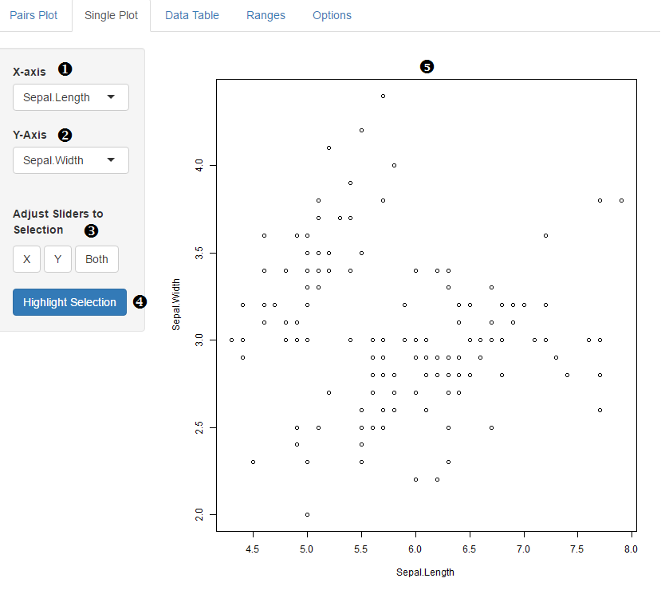

## Single Plot

**1. X variable**

Set the variable for the x axis.

**2. Y variable**

Set the variable for the y axis.

**3. Adjust sliders**

A user can click and drag on the graph [5], and once a selection is made, these buttons will adjust the filters for the x and/or y variable to only contain the data inside the selection.

**4. Highlight**

Once a user makes a selection by click-and-drag, this button will send the user to the pairs plot tab and color all the data points inside that selection.  Default blue (color can be changed in options tab.

**5. Plot display**

This is where the plot gets displayed.

**6. Near Points Info**

	By clicking on the graph, data points near the click will display their info in this panel.

